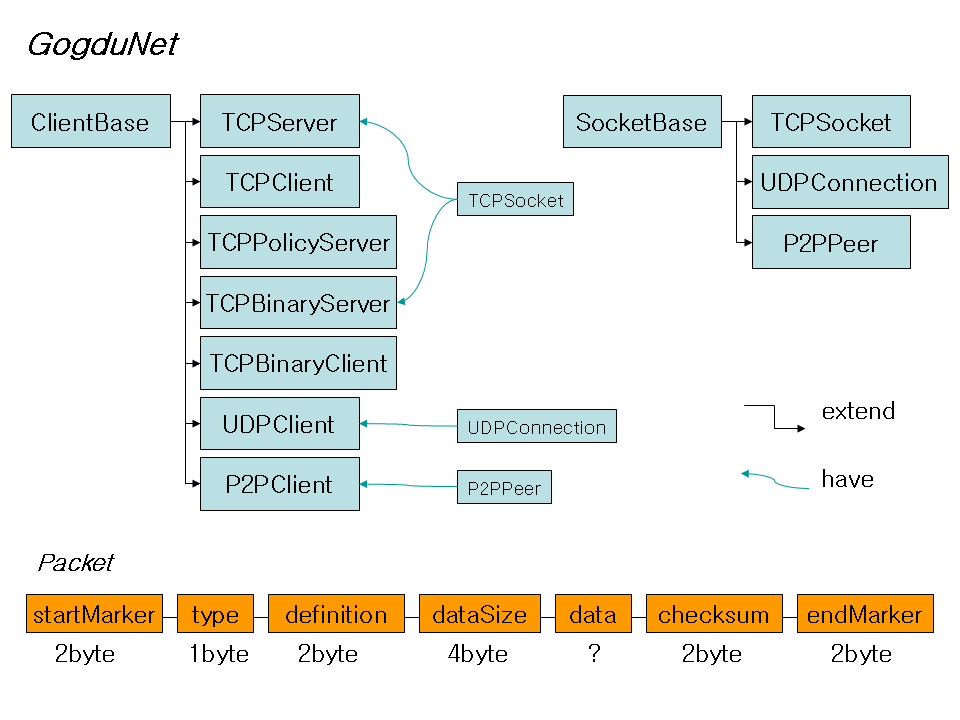

GogduNet
=====

**GogduNet** - Flash AS3 Communication Library for **TCP** and **UDP** and **P2P**

Version 2.00 (2013.7.20.)

Made by **Siyania**
(siyania@naver.com)
(http://siyania.blog.me/)

GogduNet은 JSON 문자열을 기반(TCPBinaryServer와 TCPBinaryClient는 예외)으로 통신을 하는 통신 라이브러리입니다.
몇 줄의 코드만으로 간단하게 서버나 클라이언트를 만들 수 있으며, 자동으로 잘못된 패킷을 걸러 내고,
데이터를 패킷 단위로 구분하여 사용자에게 알려 줍니다.

TCPServer : AIR 3.0 Desktop, AIR 3.8

TCPClient : Flash Player 11, AIR 3.0

TCPPolicyServer : AIR 3.0 Desktop, AIR 3.8

TCPBinaryServer : AIR 3.0 Desktop, AIR 3.8

TCPBinaryClient : Flash Player 11, AIR 3.0

UDPClient : AIR 3.0 Desktop, AIR 3.8

P2PClient : Flash Player 11, AIR 3.0

Structure
-----
