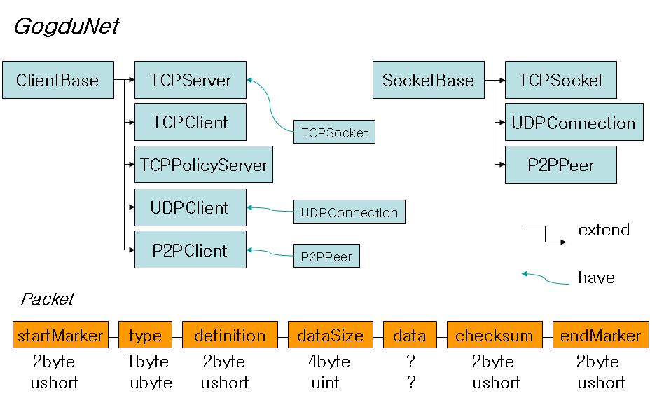

GogduNet
=====

**GogduNet** - Flash AS3 Communication Library for **TCP** and **UDP** and **P2P**

Automatic packet filtering, packet united sending, connection management, etc.

Version 4.0 (2013.8.3.)

Made by **Siyania**
(siyania@naver.com)
(http://siyania.blog.me/)

GogduNet을 사용하면 몇 줄의 코드만으로 간단하게 서버나 클라이언트를 만들 수 있으며, 자동으로 잘못된 패킷을 걸러 내고, 데이터를 패킷 단위로 구분하여 사용자에게 알려 줍니다. 또한 데이터 사용량을 줄이기 위해 패킷을 뭉쳐 보내는 기능을 지원하며, 알아서 연결을 관리해 줍니다.

Packet Filtering
-----
http://siyania.blog.me/192381011

Packet United Sending
-----

Structure
-----

-----
TCPServer : AIR 3.0 Desktop, AIR 3.8

TCPClient : Flash Player 11, AIR 3.0

TCPPolicyServer : AIR 3.0 Desktop, AIR 3.8

TCPBinaryServer : AIR 3.0 Desktop, AIR 3.8

TCPBinaryClient : Flash Player 11, AIR 3.0

UDPClient : AIR 3.0 Desktop, AIR 3.8

P2PClient : Flash Player 11, AIR 3.0

-----
Use actionscript-uuid

https://code.google.com/p/actionscript-uuid/

yonghaolai6@gmail.com